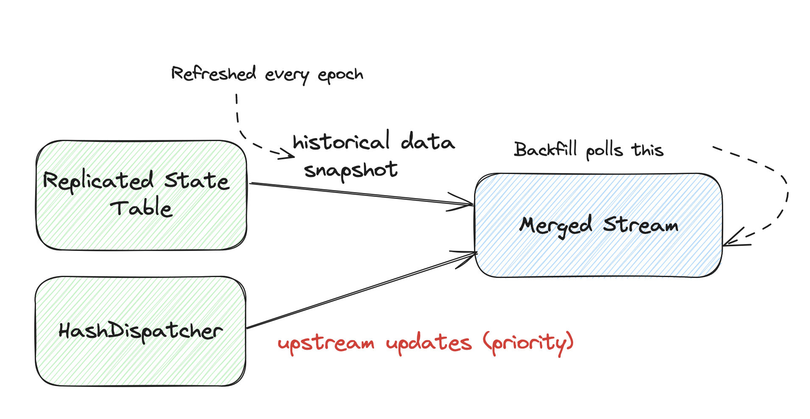
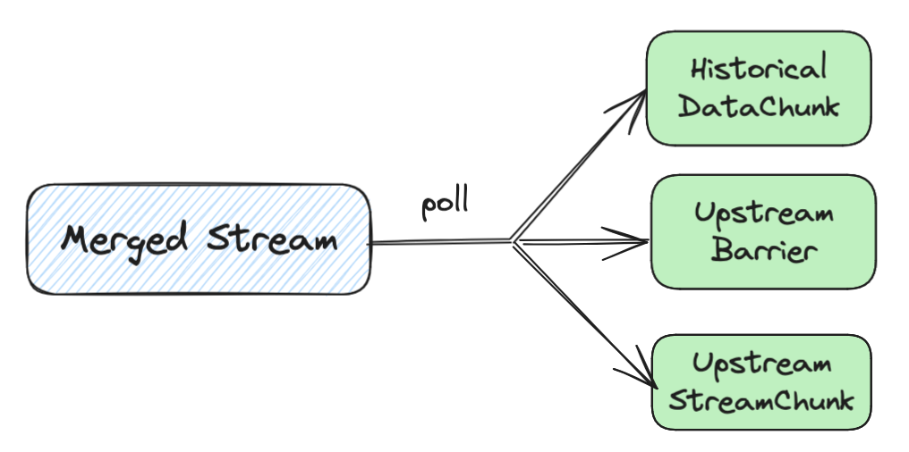
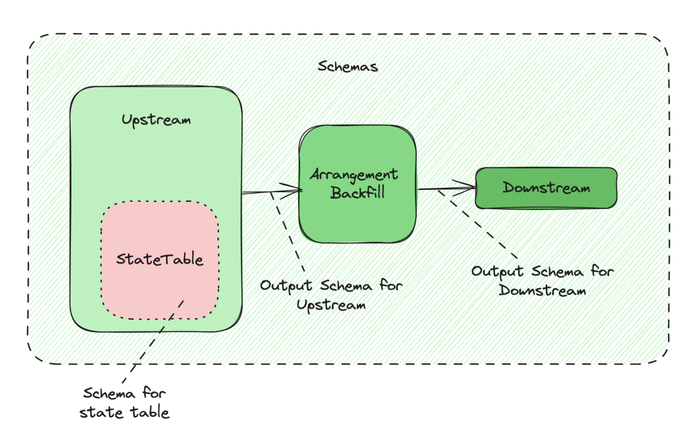
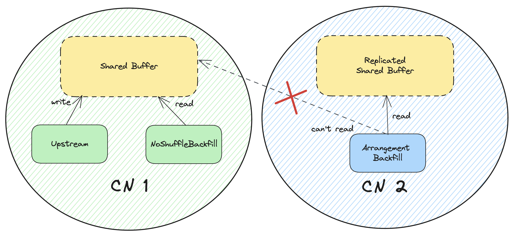
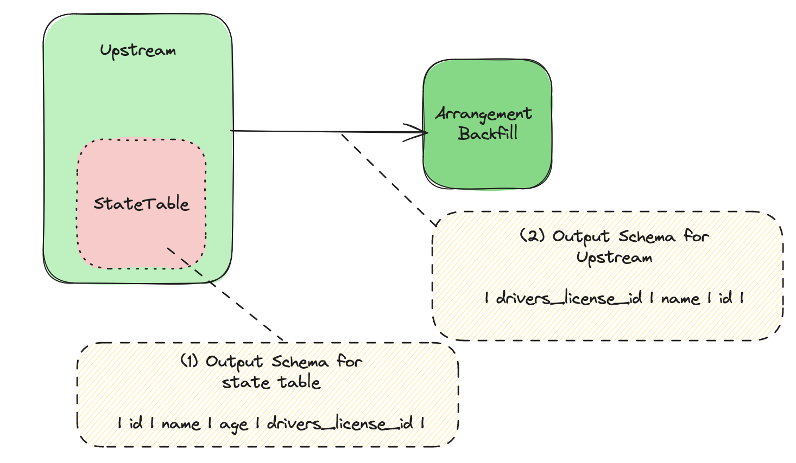

# Backfill

Backfill is used by various components of our system to merge historical data and realtime data stream.

There are many variants to it, and we will discuss them in the following sections.

## Table of Contents

- [Backfilling 101](#backfilling-101)
- [NoShuffle Backfill](#noshuffle-backfill)
- [Arrangement Backfill](#arrangement-backfill)
- [CdcBackfill](#cdc-backfill)
- [Source Backfill](#source-backfill)

## Backfilling 101

### Motivation

When creating a Materialized View on top of another one, we need to fetch all the historical data, only then we can start
processing the realtime updates, and applying them to the stream.

However, in the process of doing so, we need to either:
1. Buffer all the updates.
2. Block the upstream from sending updates (i.e. pause the entire stream graph).

For the first option, it is not feasible to buffer all the updates, when historical data takes while to process.
If we buffer all the updates it can cause OOM.

For the second option, it is also not feasible,
as we are blocking the entire stream graph whenever we create a new materialized view,
until processing historical data is done.

So we need a way to merge historical data and realtime updates, without blocking the upstream.
This can be done by Backfill.

### How it works

Backfilling is the process of merging historical data and update stream into one.

Consider the following example.

We have the following table with 1M records:
```sql
CREATE TABLE t (
  id INT PRIMARY KEY,
  name VARCHAR
);
```

Then we create a materialized view from that table:
```sql
CREATE MATERIALIZED VIEW mv AS SELECT * FROM t;
```

In one epoch `B`, we read the `historical` data from `t` up to row `2`, from data in the previous epoch `A`:

| op | id | name |
|----|----|------|
| +  | 1  | a    |
| +  | 2  | b    |

> Note that the `op` column is the operation type, and `+` means `insert`.
>
> We use `insert` since all the historical data are just inserts to the downstream materialized view.

In that same epoch `B`, suppose there are some updates to the table `t` due to `DML` statements being ran:

| op | id | name |
|----|----|------|
| +  | 4  | d    |
| -  | 1  | a    |
| .. | .. | ..   |
| -  | 99 | zzz  |
| +  | 100| zzzz |

The same updates will then be sent propagated `mv` in epoch `B`.

Since we backfilled the historical data up to row `2`, we only need to apply the updates up to row `2`.

So downstream will just receive:
1. The historical data up to row `2`.

   | op | id | name |
   |----|----|------|
   | +  | 1  | a    |
   | +  | 2  | b    |

2. The realtime delta stream up to row `2`:

    | op | id | name |
    |----|----|------|
    | -  | 1  | a    |

So we didn't need to buffer all the updates, until historical data is completely processed.
Instead at each epoch, we just read some historical data, and apply any relevant updates on them.

To ensure we always make progress,
we will keep track of the last row we backfilled to,
and continue from after that row in the next epoch.

In the following sections, we will delve into specific types of backfill.

### References

[RFC: Use Backfill To Let Mv On Mv Stream Again](https://github.com/risingwavelabs/rfcs/blob/main/rfcs/0013-use-backfill-to-let-mv-on-mv-stream-again.md)

## NoShuffle Backfill

This section will mainly discuss the implementation of NoShuffle Backfill,
as the concept is as described above.

This backfill executor is the precursor to arrangement backfill.

It is used to backfill RisingWave Materialized Views, Tables and Indexes.

`NoShuffleBackfill` executor receives upstream updates via a `NoShuffleDispatcher`.
For historical data, it uses batch scan to read snapshot data using the `StorageTable` interface.

Using the `NoShuffleDispatcher` means that the actors in the scan fragment
need to be scheduled to the same parallel unit
as the actors in the dispatcher.

This also means that the parallelism of `NoShuffleBackfill` is coupled with
its upstream fragment.

When scaling, we can't scale backfill independently as a result,
only together with the upstream fragment.

Another issue with `NoShuffleBackfill` is the way backfill state is stored.
Backfill executor stores a single latest state across all vnodes it has:

| vnode   | pk_offset |
|---------|-----------|
| 0       | 5         |
| 1       | 5         |
| 2       | 5         |

This means if we scale in or out, the state may not be accurate.
This is because the state if partitioned per vnode could be:

| vnode | pk_offset |
|-------|-----------|
| 0     | 1         |
| 1     | 2         |
| 2     | 5         |

If we ran some scaling operations, and got:

| vnode | pk_offset |
|-------|-----------|
| 3     | 0         |
| 1     | 5         |
| 2     | 5         |

It would be unclear which `pk_offset` to resume from.

In the next iteration of backfill, we have `ArrangementBackfill` which solves these issues.

## Arrangement Backfill

`ArrangementBackfill` is the next iteration of `NoShuffleBackfill` executor.

Similarly, it is used to backfill RisingWave Materialized Views, Tables and Indexes.

The main goal of `ArrangementBackfill` is to scale its parallelism independently of the upstream fragment.
This is done with `replication`.

### Differences with `NoShuffleBackfill`

First, let's discuss the key differences in components.

| Side       | NoShuffleBackfill    | ArrangementBackfill           |
|------------|----------------------|-------------------------------|
| Upstream   | NoShuffleDispatcher  | HashDispatcher                |
| Historical | Scan on StorageTable | Scan on Replicated StateTable |

For the upstream part, it's pretty straightforward.
We use a `HashDispatcher` to dispatch updates to the backfill executor,
since `ArrangementBackfill` can be on a different parallel unit than its upstream fragment.

For the historical part,
we use a `Replicated StateTable` to read historical data, and replicate the shared buffer.

### Arrangement Backfill Frontend

Arrangement Backfill is constructed in the following phases in the optimizer:
```text
(1) LogicalScan -> (2) StreamTableScan -> (3) PbStreamScan (MergeNode, ..)
```

From 2 to 3, we will compute the `output_indices` (A) from upstream to backfill,
and the `output_indices` (B) from backfill to downstream.

(B) will always be a subset of (A).
The full PK is needed for backfilling, but it is not always needed after that.

For example, consider the following queries.

```sql
create table t1(id bigint primary key, i bigint);
create materialized view mv1 as select id, i from t1 order by id, i;
create materialized view mv2 as select id from mv1;
```

`mv1` has the following plan:
```text
 StreamMaterialize { columns: [id, i], stream_key: [id], pk_columns: [id, i], pk_conflict: NoCheck }
 └─StreamTableScan { table: t1, columns: [id, i] }
```

`mv2` has the following plan:
```text
 StreamMaterialize { columns: [id], stream_key: [id], pk_columns: [id], pk_conflict: NoCheck }
 └─StreamTableScan { table: mv1, columns: [mv1.id], stream_scan_type: ArrangementBackfill, pk: [mv1.id], dist: UpstreamHashShard(mv1.id) }
(2 rows)
```

Notice how `mv2` only needs the `id` column from `mv1`, and not the full `pk` with `i`.

### Backfill logic

#### Overview



For `ArrangementBackfill`, we have 2 streams which we merge:
upstream and historical streams.
`Upstream` will be given precedence,
to make sure `Barriers` can flow through the stream graph.
Additionally, every epoch, we will refresh the historical stream, as upstream data gets checkpointed
so our snapshot is stale.



We will poll from this stream in backfill to get upstream and historical data chunks for processing,
as well as barriers to checkpoint to backfill state.

For each chunk (DataChunk / StreamChunk), we may also need to do some further processing based on their schemas.

#### Schemas



There are 3 schemas to consider when processing the backfill data:
1. The state table schema of upstream.
2. The output schema from upstream to arrangement backfill.
3. The output schema from arrangement backfill to its downstream.

For chunks coming from upstream (whether historical or directly from the dispatcher),
we will need to transform it from (2) to (3) before yielding the chunks downstream.

For chunks being replicated to the replicated state table, we need to transform them from (2) to (1),
so they match the upstream state table schema. Otherwise, deserialization for these replicated records will fail,
due to a schema mismatch.

For chunks being read from the replicated state table, it must contain logic to transform them from (1) to (2),
to ensure the historical side and the upstream side have a consistent schema.

#### Polling loop


If we poll a chunk from the historical side, we will yield it to the downstream,
and update the primary key (pk) we have backfilled to in the backfill state.

If we poll a chunk from the upstream side, we will buffer it.
This is because we need to only contain updates for historical data we have backfilled.
We can just do that at the end of the epoch, which is when we receive a barrier.
We will also replicate it by writing it to the `ReplicatedStateTable`.

If we poll a barrier from the upstream side,
we will need to flush the upstream chunk buffer.
First, transform the schema of the upstream chunk buffer from 2. to 3..
Next we will flush records which are lower or equal to the pk we have backfilled to.
Finally, we build a new snapshot stream to read historical data in the next epoch.

Then the polling loop will continue.

### Replication



Previously, when doing snapshot reads to read **Historical Data**, backfill executor is able to read
from the shared buffer for the previous epoch.
This is because it will be scheduled to the same parallel unit as the upstream.

However, with `ArrangementBackfill`,
we can't rely on the shared buffer of upstream,
since it can be on a different parallel unit.


So we need to make sure for the previous epoch, we buffer
its updates somewhere to replicate the shared buffer.

Then we can merge the shared buffer, with the current
checkpointed data to get
the historical data for that epoch.

To replicate the shared buffer, we simply just create a `ReplicatedStateTable`.
This will just store the `ReadVersions` but never upload them to the Object Store.
Then the `StateTable`'s logic will take care of
merging the shared buffer and the committed data in the Object store for us.

#### Example: Read / Write Paths Replicated Chunk

Recall from the above section on [schemas](#schemas):
> For chunks being replicated to the replicated state table, we need to transform them from (2) to (1),
so they match the upstream state table schema.
>
> For chunks being read from the replicated state table, it must contain logic to transform them from (1) to (2),
to ensure the historical side and the upstream side have a consistent schema.

Where (1) refers to the state table schema of upstream,
and (2) refers to the output schema from upstream to arrangement backfill.



Now let's consider an instance where (1) has the schema:

| id | name | age | drivers_license_id |
|----|------|-----|--------------------|

And (2) has the schema:

| drivers_license_id | name | id |
|--------------------|------|----|

Consider if we have the following chunk being replicated to the `ReplicatedStateTable`:

| drivers_license_id | name   | id |
|--------------------|--------|----|
| 1                  | 'Jack' | 29 |

We will to transform it to the schema of (1), and insert it into the `ReplicatedStateTable`:

| id | name   | age  | drivers_license_id |
|----|--------|------|--------------------|
| 29 | 'Jack' | NULL | 1                  |

This will then be serialized into kv pairs and written to the state store.

Subsequently, when reading from the state store to get historical data, we deserialize the kv pairs,
merging the shared buffer with the committed data in the Object Store.

Let's say we got this back:

| id | name   | age  | drivers_license_id |
|----|--------|------|--------------------|
| 29 | 'Jack' | NULL | 1                  |
| 30 | 'Jill' | 30   | 2                  |

Then we will transform it to the schema of (2),
and arrangement backfill will consume this historical data snapshot:

| drivers_license_id | name   | id |
|--------------------|--------|----|
| 1                  | 'Jack' | 29 |
| 2                  | 'Jill' | 30 |

#### Initialization

Something to note is that for the first snapshot,
upstream may not have finished committing data in that epoch to s3.

Additionally, we have not replicated any upstream records
during that epoch, only in the subsequent ones.

As such, we must wait for that first checkpoint to be committed,
before reading, or we risk missing the uncommitted data in our backfill.

This is supported internally inside `init_epoch` for replicated state table.
```shell
        upstream_table.init_epoch(first_epoch).await?;
```

### Recovery

TODO

### Scaling

TODO

### Further improvements

- Make backfill vnode level within each partition:
  https://github.com/risingwavelabs/risingwave/issues/14905

## Cdc Backfill

TODO

## Source Backfill

TODO
